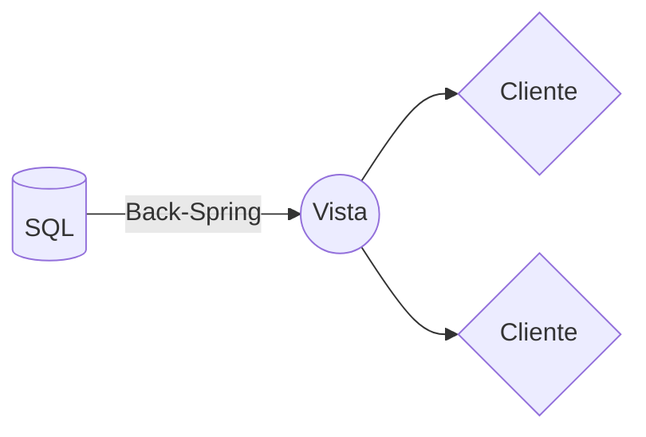
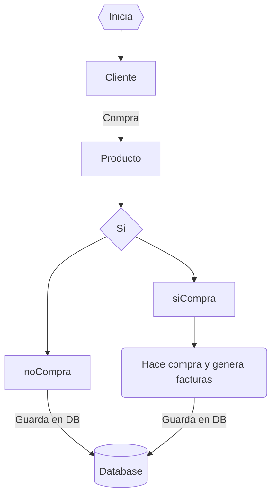

# Tienda

Se deben instalar las herramientas para la vista  **Flutter**. y para la parte logica y menejo de informacion **Java** en este caso se usa spring boot

# Java

StackEdit stores your files in your browser, which means all your files are automatically saved locally and are accessible **offline!**

    mvn spring-boot:run

And this will produce a flow chart:

**UML Caso de compra**

